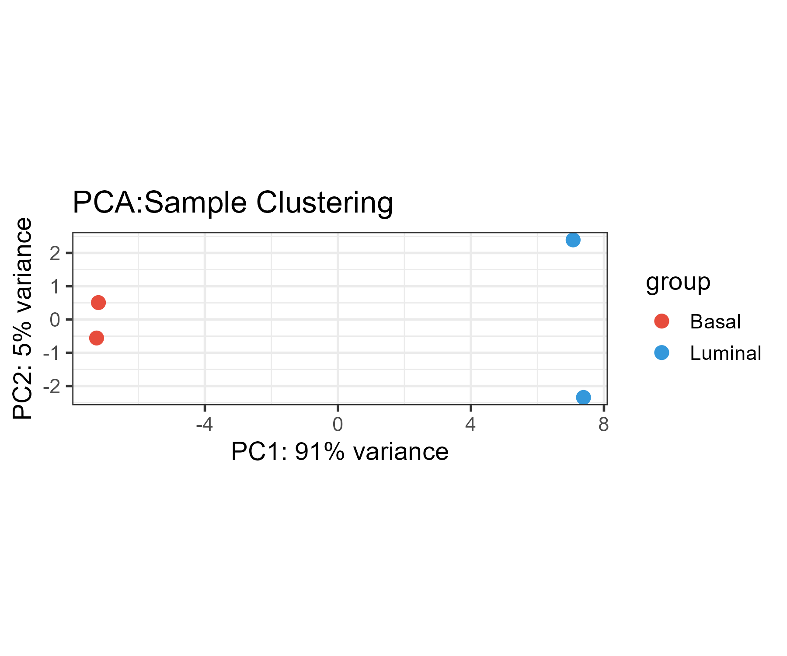
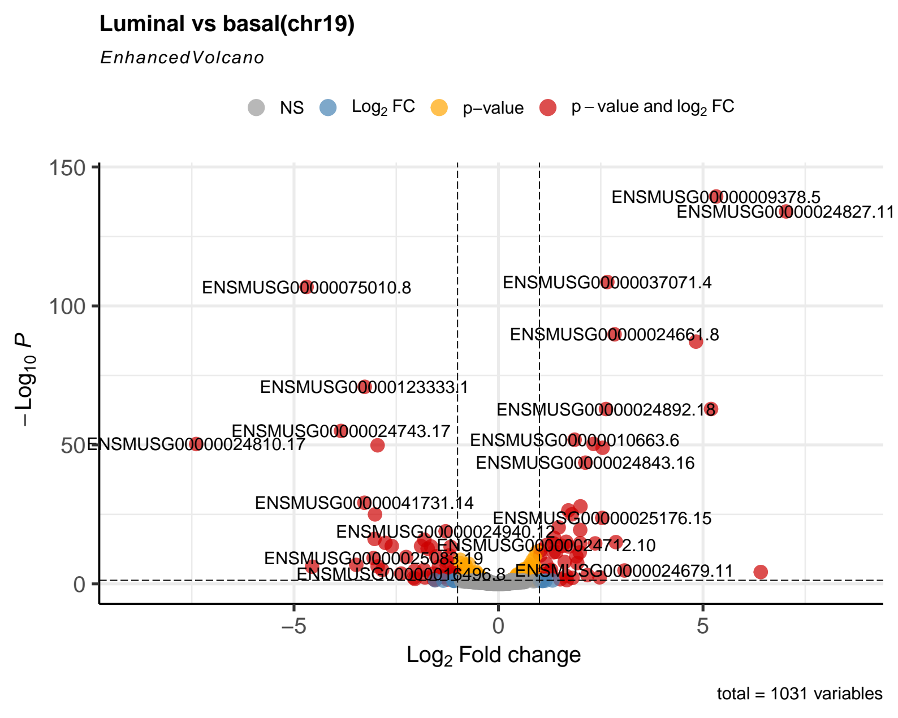

# RNA-seq Analysis Pipeline — GSE60450

基于小鼠乳腺 RNA-seq 数据（GSE60450）的完整分析流程，从原始 FASTQ 到差异表达基因及富集分析。

---

#项目背景

数据集： GSE60450（NCBI GEO）  
  物种：   Mus musculus（小鼠，GRCm39 / mm39）  
参考注释： GENCODE M36  
实验设计： Basal 乳腺上皮细胞 vs Luminal 乳腺上皮细胞（各 2 个生物学重复）  
测序类型: 单端测序（Single-end，100 bp）  
练习范围：chr19 单条染色体（节省资源，逻辑与全基因组完全一致）

| SRR ID           | 样本名       | 分组 |
| SRR1552444 | MCL1.DG | Basal |
| SRR1552445 | MCL1.DH | Basal  |
| SRR1552446 | MCL1.DI | Luminal |
| SRR1552447 | MCL1.DJ | Luminal |
---

## 分析流程

```
下载原始 FASTQ
    ↓ FastQC  （质控）
     ↓ MultiQC（汇总）
    ↓ Trimmomatic（去接头 / 过滤低质量碱基）
    ↓ FastQC（对去接头后的数据进行质控）
    ↓ FastQC（再次汇总）
    ↓ STAR（建索引 + 比对）→ BAM 文件
    ↓ featureCounts（基因计数）→ 计数矩阵
    ↓ R中读取计数矩阵，构建样本信息表和创建DESeqDataSet对象
    ↓ 进行预过滤去除低表达基因，创建PCA图
    ↓ DESeq2（差异表达分析）
    ↓ 可视化（ 火山图 / 热图 / MA图）
    ↓ GO 和 KEGG 富集分析
```

---

## 工具与版本

| 工具                 |     版本            | 用途 |
| FastQC               |   v0.12.1          | 原始数据质控 |
| Trimmomatic          |     0.40           | 去接头 / 质量过滤 |
| STAR                 |    2.7.11b         | RNA-seq 比对 |
| samtools             |   1.23.1           | BAM 文件处理 |
| featureCounts        |    2.1.1           | 基因计数 |
| DESeq2               |   1.50.2           | 差异表达分析 |
| clusterProfiler      |   4.18.4           | GO/KEGG 富集分析 |
| ggplot2              |    4.0.3           |  可视化 |
|  pheatmap            |    1.0.13          |  可视化 |
---

## 目录结构

```
rnaseq-GSE60450/
├── scripts/
│   ├── fastqc.sh                # FastQC 质控
│   ├── trimmomatic.sh     # 去接头清洗
│   ├── star_align.sh          # STAR 建索引 + 比对
│   ├── featurecounts.sh    # 基因计数
│   └── deseq2.R              # DESeq2 + 可视化 + 富集分析
├── results/
│   ├── counts_matrix.txt     # featureCounts 输出（DESeq2 输入）
│   └── figures/              # 分析结果图
│       ├── PCA_plot.png
│       ├── volcano_plot.png
│       ├── heatmap_top30.pdf
│       └── GO_BP_dotplot.png
├── doc/
│   └── methods.md            # 方法说明
├── .gitignore
└── README.md
```
---

## 关键结果

### PCA 图
两组样本分离明显，组内重复聚集，说明数据质量良好。但因为我只尝试了4个样本，所以聚集不是很明显，但可以看到两组样本明显分离。



### 火山图
展示 Luminal vs Basal 的差异表达基因全景（FDR < 0.05，|Log2FC| > 1）。



---

## 运行方法

```bash
# 1. 克隆仓库
git clone https://github.com/nanmei520/rnaseq-GSE60450
cd rnaseq-GSE60450

# 2. 创建 conda 环境
conda create -n rnaseq python=3.10 -y
conda activate rnaseq
conda install -y fastqc trimmomatic star subread samtools sra-tools -c bioconda

# 3. 按顺序运行脚本
(1) bash scripts/_fastqc.sh
(2) bash scripts/_trimmomatic.sh
(3) bash scripts/_star_align.sh
(4) bash scripts/_featurecounts.sh

# 4. 在 RStudio 中运行 DESeq2 分析
(5)打开 scripts/deseq2.R，按注释逐段运行
```

>  因为原始数据和中间文件（BAM、FASTQ 等）体积过大未上传。
> 自行从 NCBI SRA 下载原始数据：`prefetch SRR1552444 SRR1552445 SRR1552446 SRR1552447`

---

## 踩坑记录
（1）校园网在本地Linux上下载样本速度极慢，切换镜像源也很慢，故选用在网盘上速度极快下载好样本，并创建共享文件夹，跳过在Linux上下载，在Linux上进行质控。
（2）STAR 内存不足：STAR 比对全基因组需要 30GB 内存，本地机器内存不足且速度极慢，改使用阿里云服务器（64GB，16核）完成比对步骤。
（3）掌握阿里云服务器使用以及如何降低成本：在阿里云服务器完成比对后，又进行featureCounts，并将需要的结果文件进行压缩下载到本地linux。
（3）chr19 比对率低：使用 chr19 单染色体索引时，Uniquely mapped 约 8-9%，这是正常现象（其余 reads 来自其他染色体），因为我只用了其中4个样本，全基因组比对率应 >75%
（4）genomeSAindexNbases 11**：chr19 小基因组必须设此参数，完整基因组可去掉。
---

## 参考资料

- [DESeq2 官方文档](https://bioconductor.org/packages/release/bioc/vignettes/DESeq2/inst/doc/DESeq2.html)
- [GSE60450 数据集](https://www.ncbi.nlm.nih.gov/geo/query/acc.cgi?acc=GSE60450)
- [GENCODE M36 注释](https://www.gencodegenes.org/mouse/release_M36.html)
- [STAR 手册](https://github.com/alexdobin/STAR/blob/master/doc/STARmanual.pdf)
